# BattleScope V2: Distributed System Architecture

**Version**: 2.0
**Status**: Design Proposal
**Author**: Claude Code
**Date**: 2025-11-24

---

## Executive Summary

This document proposes a complete architectural redesign of BattleScope from a monolithic microservices architecture to a **fully distributed, event-driven system** with:

- **Message Bus** (Kafka single-node or Redpanda) for event streaming and inter-service communication
- **Distributed Queues** (RabbitMQ single-node + BullMQ) for job processing with guaranteed delivery
- **Service-Specific Storage** with data isolation and autonomy
- **Horizontal Scalability** designed for sudden data influx without system degradation
- **Fault Tolerance** with circuit breakers, retry mechanisms, and graceful degradation
- **Event Sourcing** for audit trails and temporal queries

**Deployment Target**: Small Kubernetes cluster (3-5 nodes, 16-32GB RAM total) suitable for DigitalOcean, Linode, Hetzner, or similar providers.

---

## Table of Contents

1. [Current Architecture Problems](#current-architecture-problems)
2. [New Distributed Architecture Overview](#new-distributed-architecture-overview)
3. [Message Bus Layer (Kafka)](#message-bus-layer-kafka)
4. [Queue Layer (RabbitMQ + BullMQ)](#queue-layer-rabbitmq--bullmq)
5. [Storage Strategy](#storage-strategy)
6. [Service Architecture](#service-architecture)
7. [Data Flow Diagrams](#data-flow-diagrams)
8. [Scalability Design](#scalability-design)
9. [Fault Tolerance](#fault-tolerance)
10. [Migration Strategy](#migration-strategy)

---

## Current Architecture Problems

### 1. **Single Points of Failure**
- Redis is used for both caching AND queuing (dual responsibility)
- PostgreSQL has no replication or sharding strategy
- If Redis fails, both cache and enrichment queue are lost
- If PostgreSQL fails, entire system is down

### 2. **Tight Coupling**
- All services share the same database
- Direct database queries create schema coupling
- No clear service boundaries at data level
- Difficult to version or migrate schemas independently

### 3. **Limited Scalability**
- BullMQ queue depth issues under heavy load (identified in analysis)
- Synchronous ESI API calls block processing
- No backpressure handling
- Poll-based ingestion can miss killmails

### 4. **No Retry/Recovery Strategy**
- Failed enrichment jobs are lost (identified in audit)
- No dead letter queues
- No circuit breakers for external APIs
- No graceful degradation

### 5. **Observability Gaps**
- No distributed tracing correlation IDs across services
- Metrics exist but no alerting on queue depth/lag
- No SLOs defined for data freshness

---

## New Distributed Architecture Overview

> **📊 Full Diagram**: See [diagrams/01-system-overview.mmd](./diagrams/01-system-overview.mmd)


---

## Message Bus Layer (Kafka)

### Why Kafka?

- **High Throughput**: 1M+ messages/sec per broker
- **Durability**: Replicated, persistent event log
- **Replay**: Consumers can replay events from any offset
- **Multiple Consumers**: Different services consume same stream
- **Ordering Guarantees**: Per-partition ordering
- **Backpressure Handling**: Built-in consumer lag monitoring

### Kafka Topics


### Event Schemas

**killmail.ingested**:
```json
{
  "eventId": "uuid",
  "eventType": "killmail.ingested",
  "timestamp": "2025-11-24T10:15:30Z",
  "version": "2.0",
  "data": {
    "killmailId": "123456789",
    "systemId": "30000142",
    "occurredAt": "2025-11-24T10:00:00Z",
    "victimAllianceId": "99000001",
    "attackerAllianceIds": ["99000002", "99000003"],
    "iskValue": "1500000000",
    "zkbUrl": "https://zkillboard.com/kill/123456789/"
  },
  "metadata": {
    "correlationId": "trace-id-123",
    "causationId": "parent-event-id",
    "source": "ingest-service-pod-abc"
  }
}
```

**killmail.enriched**:
```json
{
  "eventId": "uuid",
  "eventType": "killmail.enriched",
  "timestamp": "2025-11-24T10:15:35Z",
  "version": "2.0",
  "data": {
    "killmailId": "123456789",
    "systemId": "30000142",
    "victim": {
      "characterId": "90000001",
      "corporationId": "98000001",
      "allianceId": "99000001",
      "shipTypeId": "12345"
    },
    "attackers": [
      {
        "characterId": "90000002",
        "corporationId": "98000002",
        "allianceId": "99000002",
        "shipTypeId": "12346",
        "finalBlow": true
      }
    ],
    "fullPayload": { /* complete zKillboard JSON */ }
  },
  "metadata": {
    "correlationId": "trace-id-123",
    "causationId": "event-id-from-ingested",
    "source": "enrichment-worker-xyz",
    "enrichmentDurationMs": 234
  }
}
```

**battle.created**:
```json
{
  "eventId": "uuid",
  "eventType": "battle.created",
  "timestamp": "2025-11-24T10:20:00Z",
  "version": "2.0",
  "data": {
    "battleId": "uuid-battle-123",
    "systemId": "30000142",
    "startTime": "2025-11-24T09:45:00Z",
    "endTime": "2025-11-24T10:15:00Z",
    "totalKills": 47,
    "totalIskDestroyed": "12500000000",
    "participantCount": 89,
    "killmailIds": ["123456789", "123456790", "..."],
    "sides": [
      {
        "sideId": 1,
        "allianceIds": ["99000001"],
        "kills": 25,
        "losses": 22
      }
    ]
  },
  "metadata": {
    "correlationId": "trace-id-456",
    "source": "clusterer-service",
    "clusteringAlgorithm": "sliding-window-v2"
  }
}
```

**battle.updated** (Retroactive Attribution):
```json
{
  "eventId": "uuid",
  "eventType": "battle.updated",
  "timestamp": "2025-11-24T11:30:00Z",
  "version": "2.0",
  "data": {
    "battleId": "uuid-battle-123",
    "systemId": "30000142",
    "startTime": "2025-11-24T09:45:00Z",  // May be extended backwards
    "endTime": "2025-11-24T10:30:00Z",     // Extended forward
    "totalKills": 53,                       // Increased from 47
    "totalIskDestroyed": "15000000000",     // Increased
    "participantCount": 95,                 // Increased from 89
    "killmailIds": ["123456789", "...", "123456850"],  // New killmails added
    "addedKillmails": ["123456845", "123456846", "123456850"],  // Delta
    "updateReason": "retroactive_attribution",
    "sides": [
      {
        "sideId": 1,
        "allianceIds": ["99000001"],
        "kills": 28,    // Updated
        "losses": 25    // Updated
      }
    ]
  },
  "metadata": {
    "correlationId": "trace-id-789",
    "causationId": "killmail-enriched-event-id",
    "source": "clusterer-service",
    "updateTrigger": "late_arrival_killmail"
  }
}
```

### Retroactive Battle Attribution Scenarios

**When does `battle.updated` get published?**

1. **Late-Arriving Killmails** (Most Common)
   - Killmail arrives 10-30 minutes after the battle "ended"
   - Falls within temporal window of existing battle
   - Has participant overlap with battle
   - **Action**: Clusterer adds killmail to battle, extends `endTime`, publishes `battle.updated`

2. **Out-of-Order Killmail Processing**
   - zKillboard RedisQ doesn't guarantee ordering
   - Killmail with earlier timestamp arrives after battle was clustered
   - Falls within battle time window
   - **Action**: Clusterer adds killmail, may extend `startTime` backwards, publishes `battle.updated`

3. **Manual Re-clustering** (Admin Action)
   - Admin triggers re-clustering of a time range
   - Clustering algorithm finds new correlations
   - **Action**: Clusterer re-evaluates battles, publishes `battle.updated` events

4. **Battle Merging**
   - Late killmail creates temporal/participant bridge between two separate battles
   - Algorithm determines battles should be merged
   - **Action**: Clusterer merges battles, publishes `battle.updated` for merged battle, `battle.deleted` for absorbed battle

**Example Timeline**:
```
10:00 - Battle starts (Fleet A vs Fleet B in J123456)
10:15 - 40 kills processed → battle.created (battleId: abc-123)
10:20 - Battle appears to end (no more kills for 5 minutes)
10:25 - Clusterer finalizes battle → battle.created published
10:35 - Late killmail arrives (timestamp: 10:18, same participants)
10:36 - Clusterer detects match → battle.updated published
          - Added 1 killmail retroactively
          - endTime extended from 10:15 to 10:18
          - totalKills: 40 → 41
```

### Message Bus Configuration (Redpanda)

**Why Redpanda over Kafka?**
- 10x less memory usage (works well on small clusters)
- No JVM/Zookeeper overhead
- Kafka API compatible (drop-in replacement)
- Single-node deployment viable for small workloads

```yaml
redpanda:
  deployment: single-node
  resources:
    memory: 2Gi
    cpu: 1000m
  storage:
    size: 50Gi
    class: ssd
  topics:
    killmail.ingested:
      partitions: 8  # Reduced for single-node
      retentionMs: 604800000  # 7 days
      cleanupPolicy: delete
    killmail.enriched:
      partitions: 8  # Reduced for single-node
      retentionMs: 604800000
      cleanupPolicy: delete
    battle.created:
      partitions: 4  # Reduced for single-node
      retentionMs: 2592000000  # 30 days
      cleanupPolicy: delete
    audit.events:
      partitions: 2  # Reduced for single-node
      retentionMs: 31536000000  # 365 days
      cleanupPolicy: compact
  producerConfig:
    acks: 1  # Reduced from 'all' for single-node
    compression: lz4
    batchSize: 16384
    lingerMs: 10
    maxInFlightRequests: 5
  consumerConfig:
    autoOffsetReset: earliest
    enableAutoCommit: false
    maxPollRecords: 500
    sessionTimeoutMs: 30000
  performance:
    note: "Single-node Redpanda can handle 100k+ msgs/sec on modest hardware"
```

---

## Queue Layer (RabbitMQ + BullMQ)

### Why Two Queue Systems?

- **Kafka**: Event streaming, multiple consumers, replay capability
- **RabbitMQ**: Traditional job queues, priority queues, dead letter queues
- **BullMQ**: Redis-based queues for low-latency, high-throughput jobs

### RabbitMQ Architecture


### RabbitMQ Configuration

```yaml
rabbitmq:
  deployment: single-node
  resources:
    memory: 1Gi
    cpu: 500m
  persistence:
    enabled: true
    size: 20Gi
  exchanges:
    enrichment:
      type: topic
      durable: true
      autoDelete: false
    search:
      type: fanout
      durable: true
    notification:
      type: topic
      durable: true
  queues:
    enrichment.high:
      durable: true
      maxPriority: 10
      messageTtl: 3600000  # 1 hour
      maxLength: 100000
      deadLetterExchange: enrichment.dlx
    enrichment.normal:
      durable: true
      maxPriority: 5
      messageTtl: 7200000  # 2 hours
      maxLength: 500000
      deadLetterExchange: enrichment.dlx
    enrichment.low:
      durable: true
      maxPriority: 1
      messageTtl: 86400000  # 24 hours
      maxLength: 1000000
      deadLetterExchange: enrichment.dlx
    enrichment.dlq:
      durable: true
      messageTtl: 604800000  # 7 days
      maxLength: 50000
```

### BullMQ (Redis-based) Configuration

```typescript
// Used for high-frequency, low-latency jobs
const bullmqQueues = {
  'cache-invalidation': {
    redis: 'redis-cluster:6379',
    defaultJobOptions: {
      attempts: 3,
      backoff: {
        type: 'exponential',
        delay: 1000,
      },
      removeOnComplete: 1000,
      removeOnFail: 5000,
    },
    limiter: {
      max: 10000,
      duration: 1000,
    },
  },
  'notification-fanout': {
    redis: 'redis-cluster:6379',
    defaultJobOptions: {
      attempts: 2,
      backoff: {
        type: 'fixed',
        delay: 500,
      },
      removeOnComplete: 100,
      removeOnFail: 1000,
    },
  },
};
```

---

## Storage Strategy

### Service-Specific Databases

Each service owns its data and exposes APIs (never direct DB access):


### Storage Specifications

**Architecture Principle**: Each service domain owns its own PostgreSQL instance. Data transfer between services is **exclusively through Kafka events** (no direct database access, no foreign keys across services).

#### 1. Ingestion Database (Ingestion Service)

```yaml
statefulset: postgresql-ingestion
resources:
  memory: 1Gi
  cpu: 500m
  storage: 20Gi SSD
database:
  name: ingestion
  owner: battlescope_ingest
  version: postgresql-15
tables:
  - killmail_events:
      description: "Raw killmail references from zKillboard"
      partitioning: BY RANGE (occurred_at) MONTHLY
      indexes:
        - occurred_at_idx (BRIN)
        - system_id_idx
        - killmail_id_idx (PRIMARY KEY)
      retention: 30 days (then archived)
      columns:
        - killmailId (bigint, PK)
        - systemId (bigint)
        - occurredAt (timestamptz)
        - victimAllianceId (bigint, nullable)
        - attackerAllianceIds (bigint[], nullable)
        - iskValue (bigint, nullable)
        - zkbUrl (text)
        - fetchedAt (timestamptz)

  - rulesets:
      description: "Ingestion filter rules"
      indexes:
        - active_idx
        - updated_at_idx

connections:
  maxConnections: 20
  sharedBuffers: 256Mi
  effectiveCacheSize: 768Mi

dataFlow:
  writes: Ingest Service ONLY
  reads: Ingest Service ONLY
  publishes: killmail.ingested events to Kafka
  note: "NO other service can access this database"
```

#### 2. Battles Database (Clusterer Service)

```yaml
statefulset: postgresql-battles
resources:
  memory: 2Gi
  cpu: 1000m
  storage: 50Gi SSD
database:
  name: battles
  owner: battlescope_cluster
  version: postgresql-15
tables:
  - battles:
      description: "Clustered battle records"
      partitioning: BY RANGE (start_time) MONTHLY
      indexes:
        - battle_id_idx (PRIMARY KEY)
        - start_time_idx (BRIN)
        - system_id_idx
        - participants_gin_idx (GIN on participant arrays)
      columns:
        - battleId (uuid, PK)
        - systemId (bigint)
        - startTime (timestamptz)
        - endTime (timestamptz)
        - totalKills (int)
        - totalIskDestroyed (bigint)
        - participantCount (int)
        - zkbRelatedUrl (text)

  - battle_killmails:
      description: "Killmails belonging to battles"
      partitioning: BY RANGE (timestamp) MONTHLY
      indexes:
        - battle_id_killmail_id_idx (PRIMARY KEY composite)
        - battle_id_idx
        - killmail_id_idx
      note: "NO foreign key to ingestion database"

  - battle_participants:
      description: "Participants in battles"
      indexes:
        - battle_id_character_id_idx (PRIMARY KEY composite)
        - character_id_idx
        - alliance_id_idx
        - corporation_id_idx

  - pilot_ship_history:
      description: "Ship usage tracking for intel"
      partitioning: BY RANGE (last_seen) MONTHLY
      indexes:
        - character_id_ship_type_idx (composite)

connections:
  maxConnections: 30
  sharedBuffers: 512Mi
  effectiveCacheSize: 1536Mi

dataFlow:
  writes: Clusterer Service ONLY
  reads: Clusterer Service ONLY
  consumes: killmail.enriched events from Kafka
  publishes: battle.created, battle.updated events to Kafka
  note: "NO direct access to ingestion database - receives data via Kafka"
```

#### 3. Query Database (API Service)

```yaml
statefulset: postgresql-query
resources:
  memory: 1Gi
  cpu: 500m
  storage: 20Gi SSD
database:
  name: query
  owner: battlescope_api
  version: postgresql-15
tables:
  - battle_summaries:
      type: MATERIALIZED VIEW
      description: "Denormalized battle data for API queries"
      refreshStrategy: CONCURRENTLY
      refreshSchedule: "*/5 * * * *"  # Every 5 minutes
      indexes:
        - battle_id_idx (PRIMARY KEY)
        - start_time_idx
        - system_id_idx
      source: Rebuilt from Kafka events

  - entity_statistics:
      type: MATERIALIZED VIEW
      description: "Alliance/corp/character statistics"
      refreshStrategy: CONCURRENTLY
      refreshSchedule: "*/15 * * * *"  # Every 15 minutes

  - recent_battles:
      type: MATERIALIZED VIEW
      description: "Last 1000 battles for quick access"
      refreshStrategy: CONCURRENTLY
      refreshSchedule: "*/1 * * * *"  # Every minute

connections:
  maxConnections: 50
  sharedBuffers: 256Mi
  effectiveCacheSize: 768Mi

dataFlow:
  writes: Kafka consumer ONLY (rebuilds from events)
  reads: API Service ONLY
  consumes: battle.created, battle.updated events from Kafka
  publishes: NONE (read-only projections)
  note: "CQRS pattern - command side is Battles DB, query side is this DB"
```

#### 4. Event Store Database (Event Sourcing)

```yaml
statefulset: postgresql-events
resources:
  memory: 1Gi
  cpu: 500m
  storage: 30Gi SSD
database:
  name: events
  owner: battlescope_events
  version: postgresql-15
tables:
  - event_store:
      description: "Append-only event log for audit and replay"
      partitioning: BY RANGE (timestamp) MONTHLY
      indexes:
        - event_id_idx (PRIMARY KEY)
        - timestamp_idx (BRIN)
        - event_type_idx
        - correlation_id_idx
        - aggregate_id_idx
      retention: 180 days (then archived to S3)
      columns:
        - eventId (uuid, PK)
        - eventType (text)
        - aggregateId (text)
        - aggregateType (text)
        - eventData (jsonb)
        - metadata (jsonb)
        - timestamp (timestamptz)
        - correlationId (uuid)

  - event_snapshots:
      description: "Point-in-time snapshots for faster replay"
      indexes:
        - aggregate_id_version_idx (composite PRIMARY KEY)

connections:
  maxConnections: 20
  sharedBuffers: 256Mi
  effectiveCacheSize: 768Mi

dataFlow:
  writes: All services publish to Kafka → Event Store consumer writes
  reads: Event Store Service, Analytics, Audit
  consumes: ALL Kafka topics (complete event log)
  publishes: NONE (archive only)
  note: "Single source of truth for all system events"
```

#### Backup Strategy (Per Database)

```yaml
backup:
  method: pg_dump per database
  schedule: "0 2 * * *"  # Daily at 2 AM UTC
  retention: 7 days
  storage: S3-compatible (Backblaze B2 / Wasabi)

  databases:
    - postgresql-ingestion:
        priority: low  # Short retention, can be rebuilt
        size: ~5-10Gi

    - postgresql-battles:
        priority: HIGH  # Critical data
        size: ~30-40Gi

    - postgresql-query:
        priority: low  # Can be rebuilt from events
        size: ~10-15Gi

    - postgresql-events:
        priority: CRITICAL  # Source of truth
        size: ~20-25Gi
        archival: S3 after 180 days
```

### Frontend Data Flow

> **📊 Full Diagram**: See [diagrams/02-frontend-data-flow.mmd](./diagrams/02-frontend-data-flow.mmd)

**Important**: The API Service acts as the unified data gateway for the frontend. It reads from the Query Database (which is a read-optimized projection rebuilt from Kafka events using CQRS pattern).


**Key Points**:
1. **Frontend** only talks to **API Service** (never directly to databases)
2. **API Service** reads from **Query Database** (optimized for reads)
3. **Query Database** is rebuilt from **Kafka events** (CQRS pattern)
4. **Battles Database** publishes events to Kafka after clustering
5. **Redis Cache** reduces database load (60s-300s TTL)

**Data Consistency**:
- **API responses**: Eventually consistent (5min lag max)
- **Real-time updates**: WebSocket/SSE from Notification Service
- **Cache invalidation**: On battle.created events

#### Consolidated Redis Configuration
```yaml
redis:
  deployment: single-instance
  resources:
    memory: 1Gi
    cpu: 500m
  persistence:
    enabled: true
    strategy: AOF (append-only file)
    fsync: everysec
    storage: 10Gi
  maxmemoryPolicy: allkeys-lru
  databases:
    0: api-cache  # Battle lists, entity names
    1: esi-cache  # EVE API responses
    2: enrichment-cache  # Killmail payloads
    3: ga4-buffer  # Analytics event buffer
    4: notifications  # WebSocket subscriptions
    5: sessions  # User sessions (auth)
    6: bullmq  # BullMQ job queues
  configuration:
    maxclients: 1000
    timeout: 300
    tcpBacklog: 511
    maxmemory: 900Mi  # Leave 100Mi for overhead
```

#### Analytics Integration (Google Analytics 4)
```yaml
analytics:
  provider: google-analytics-4
  method: measurement-protocol
  api:
    endpoint: https://www.google-analytics.com/mp/collect
    version: v2
  configuration:
    measurementId: G-XXXXXXXXXX
    apiSecret: ${GA4_API_SECRET}
  batching:
    enabled: true
    maxBatchSize: 25  # GA4 limit per request
    maxWaitMs: 5000
    bufferQueue: redis
  events:
    - killmail_ingested:
        category: ingestion
        parameters:
          system_id: string
          alliance_id: string
          isk_value: number
    - killmail_enriched:
        category: enrichment
        parameters:
          enrichment_duration_ms: number
          source: string
    - battle_created:
        category: clustering
        parameters:
          battle_id: string
          system_id: string
          total_kills: number
          total_isk: number
          participant_count: number
    - api_request:
        category: api
        parameters:
          endpoint: string
          method: string
          status_code: number
          duration_ms: number
  rateLimiting:
    maxEventsPerSecond: 100
    burst: 200
  errorHandling:
    retries: 3
    retryBackoff: exponential
    dlq: ga4-events-dlq
```

---

## Service Architecture

### Service Communication Patterns

```mermaid
graph LR
    subgraph "Communication Patterns"
        SYNC[Synchronous<br/>REST/gRPC<br/>Request-Response]
        ASYNC[Asynchronous<br/>Kafka Events<br/>Fire-and-Forget]
        QUEUE[Job Queue<br/>RabbitMQ/BullMQ<br/>Guaranteed Delivery]
        STREAM[Stream Processing<br/>Kafka Streams<br/>Stateful Processing]
    end

    subgraph "When to Use"
        SYNC_USE[Use for:<br/>• Query requests<br/>• Auth checks<br/>• Cache lookups]
        ASYNC_USE[Use for:<br/>• Event notifications<br/>• Data replication<br/>• Audit logs]
        QUEUE_USE[Use for:<br/>• Enrichment jobs<br/>• Background tasks<br/>• Retryable work]
        STREAM_USE[Use for:<br/>• Aggregations<br/>• Windowing<br/>• Joins]
    end

    SYNC -->|Pattern| SYNC_USE
    ASYNC -->|Pattern| ASYNC_USE
    QUEUE -->|Pattern| QUEUE_USE
    STREAM -->|Pattern| STREAM_USE
```



### Service Specifications

#### 1. Ingest Service (Redesigned)

**Responsibilities**:
- Poll zKillboard RedisQ (multiple queues for redundancy)
- Apply ruleset filters
- Publish `killmail.ingested` events to Kafka
- Store minimal reference in Ingestion DB
- Monitor ingestion lag and health

**Scaling**:
```yaml
deployment:
  replicas: 2
  hpa:
    minReplicas: 2
    maxReplicas: 10
    metrics:
      - type: Resource
        resource:
          name: cpu
          target:
            type: Utilization
            averageUtilization: 70
      - type: Pods
        pods:
          metric:
            name: kafka_producer_lag
          target:
            type: AverageValue
            averageValue: "100"
resources:
  requests:
    cpu: 200m
    memory: 256Mi
  limits:
    cpu: 1000m
    memory: 1Gi
```

**Configuration**:
```yaml
ingest:
  zkillboard:
    queues:
      - id: battlescope-primary
        url: https://zkillredisq.stream/listen.php
        pollInterval: 5s
      - id: battlescope-backup
        url: https://zkillredisq.stream/listen.php
        pollInterval: 5s
    timeout: 30s
    retries: 3
  kafka:
    topic: killmail.ingested
    producerConfig:
      acks: all
      compression: lz4
  rulesets:
    cacheSeconds: 300
    source: ingestion-db
  circuitBreaker:
    failureThreshold: 5
    timeout: 30s
    resetTimeout: 60s
```

#### 2. Enrichment Workers (Redesigned)

**Responsibilities**:
- Consume `killmail.ingested` from Kafka
- Fetch full payload from zKillboard API
- Cache enriched data in Redis
- Publish `killmail.enriched` to Kafka
- Handle failures with exponential backoff
- Route to DLQ after max retries

**Scaling**:
```yaml
deployment:
  replicas: 5
  hpa:
    minReplicas: 5
    maxReplicas: 50
    metrics:
      - type: Pods
        pods:
          metric:
            name: kafka_consumer_lag
          target:
            type: AverageValue
            averageValue: "1000"
      - type: Resource
        resource:
          name: cpu
          target:
            type: Utilization
            averageUtilization: 75
```

**Circuit Breaker**:
```typescript
const circuitBreakerConfig = {
  zkillboard: {
    failureThreshold: 5,
    successThreshold: 2,
    timeout: 30000,
    resetTimeout: 60000,
    fallback: async (killmailId) => {
      // Requeue to RabbitMQ low-priority queue
      await rabbitmq.publish('enrichment.low', { killmailId });
    },
  },
};
```

#### 3. Clusterer Service (Redesigned)

**Responsibilities**:
- Consume `killmail.enriched` from Kafka
- Run sliding window clustering algorithm
- Store battles in sharded Battles DB
- Publish `battle.created` events
- Track clustering metrics

**Stateful Processing** (Kafka Streams):
```typescript
const clusteringTopology = kstream
  .stream('killmail.enriched')
  .filter((key, value) => value.systemId != null)
  .groupByKey()  // Group by systemId
  .windowedBy(TimeWindows.of(Duration.ofMinutes(30)))
  .aggregate(
    () => new BattleCluster(),
    (systemId, killmail, cluster) => {
      cluster.addKillmail(killmail);
      return cluster;
    }
  )
  .toStream()
  .filter((windowedKey, cluster) => cluster.isComplete())
  .map((windowedKey, cluster) => {
    const battle = cluster.toBattle();
    return new KeyValue(battle.id, battle);
  })
  .to('battle.created');
```

#### 4. Query Service (New)

**Responsibilities**:
- Serve API requests (REST)
- Read from query database (replicas)
- Cache-aside pattern with Redis
- Federate queries across domains
- Authentication & authorization

**API Gateway Pattern**:


#### 5. Notification Service (New)

**Responsibilities**:
- Maintain WebSocket connections
- Consume `battle.created` events
- Push real-time notifications to clients
- Handle connection lifecycle

**WebSocket Architecture**:
```typescript
const notificationService = {
  connections: new Map<string, WebSocket>(),

  subscribe: async (accountId: string, filters: NotificationFilters) => {
    // Store subscription in Redis with TTL
    await redis.setex(
      `notification:sub:${accountId}`,
      3600,
      JSON.stringify(filters)
    );
  },

  handleEvent: async (event: BattleCreatedEvent) => {
    // Query Redis for subscriptions matching event
    const subscriptions = await redis.keys('notification:sub:*');

    for (const key of subscriptions) {
      const accountId = key.split(':')[2];
      const filters = JSON.parse(await redis.get(key));

      if (matchesFilters(event, filters)) {
        const ws = connections.get(accountId);
        if (ws && ws.readyState === WebSocket.OPEN) {
          ws.send(JSON.stringify(event));
        }
      }
    }
  },
};
```

#### 6. Analytics Service (New)

**Responsibilities**:
- Consume all events from Kafka for analytics
- Transform events into GA4 Measurement Protocol format
- Batch events for efficient API usage
- Send events to Google Analytics 4
- Handle rate limiting and errors
- Track system performance metrics

**GA4 Integration Architecture**:
```typescript
import { GoogleAnalytics4 } from '@google-analytics/measurement-protocol';

interface GA4Event {
  name: string;
  params: Record<string, string | number>;
}

class AnalyticsService {
  private ga4Client: GoogleAnalytics4;
  private eventBuffer: GA4Event[] = [];
  private readonly BATCH_SIZE = 25; // GA4 limit
  private readonly FLUSH_INTERVAL_MS = 5000;

  constructor(measurementId: string, apiSecret: string) {
    this.ga4Client = new GoogleAnalytics4(measurementId, apiSecret);
    this.startFlushInterval();
  }

  async handleKillmailIngested(event: KillmailIngestedEvent): Promise<void> {
    const ga4Event: GA4Event = {
      name: 'killmail_ingested',
      params: {
        system_id: event.data.systemId,
        alliance_id: event.data.victimAllianceId,
        isk_value: Number(event.data.iskValue),
        event_timestamp: event.timestamp,
        correlation_id: event.metadata.correlationId,
      },
    };

    await this.bufferEvent(ga4Event);
  }

  async handleBattleCreated(event: BattleCreatedEvent): Promise<void> {
    const ga4Event: GA4Event = {
      name: 'battle_created',
      params: {
        battle_id: event.data.battleId,
        system_id: event.data.systemId,
        total_kills: event.data.totalKills,
        total_isk: Number(event.data.totalIskDestroyed),
        participant_count: event.data.participantCount,
        duration_minutes: Math.floor(
          (new Date(event.data.endTime).getTime() -
           new Date(event.data.startTime).getTime()) / 60000
        ),
        event_timestamp: event.timestamp,
      },
    };

    await this.bufferEvent(ga4Event);
  }

  async handleApiRequest(request: ApiRequestEvent): Promise<void> {
    const ga4Event: GA4Event = {
      name: 'api_request',
      params: {
        endpoint: request.endpoint,
        method: request.method,
        status_code: request.statusCode,
        duration_ms: request.durationMs,
        user_id: request.accountId || 'anonymous',
        event_timestamp: request.timestamp,
      },
    };

    await this.bufferEvent(ga4Event);
  }

  private async bufferEvent(event: GA4Event): Promise<void> {
    this.eventBuffer.push(event);

    if (this.eventBuffer.length >= this.BATCH_SIZE) {
      await this.flush();
    }
  }

  private async flush(): Promise<void> {
    if (this.eventBuffer.length === 0) return;

    const batch = this.eventBuffer.splice(0, this.BATCH_SIZE);

    try {
      await this.ga4Client.sendBatch(batch, {
        timeout: 5000,
        retries: 3,
      });
    } catch (error) {
      // On failure, push to DLQ for later retry
      await this.pushToDLQ(batch, error);
      logger.error({ error, batchSize: batch.length }, 'Failed to send GA4 batch');
    }
  }

  private startFlushInterval(): void {
    setInterval(() => this.flush(), this.FLUSH_INTERVAL_MS);
  }

  private async pushToDLQ(events: GA4Event[], error: Error): Promise<void> {
    await rabbitmq.publish('ga4-events-dlq', {
      events,
      error: error.message,
      timestamp: new Date().toISOString(),
    });
  }
}
```

**Scaling**:
```yaml
deployment:
  replicas: 2
  hpa:
    minReplicas: 2
    maxReplicas: 5
    metrics:
      - type: Pods
        pods:
          metric:
            name: kafka_consumer_lag
          target:
            type: AverageValue
            averageValue: "1000"
resources:
  requests:
    cpu: 100m
    memory: 256Mi
  limits:
    cpu: 500m
    memory: 1Gi
```

**Configuration**:
```yaml
analytics:
  ga4:
    measurementId: ${GA4_MEASUREMENT_ID}
    apiSecret: ${GA4_API_SECRET}
    endpoint: https://www.google-analytics.com/mp/collect
  batching:
    maxBatchSize: 25
    flushIntervalMs: 5000
  kafka:
    consumerGroup: analytics-ga4
    topics:
      - killmail.ingested
      - killmail.enriched
      - battle.created
      - api.requests
  rateLimiting:
    maxRequestsPerSecond: 20
    burst: 50
  circuitBreaker:
    failureThreshold: 5
    timeout: 10000
    resetTimeout: 60000
```

---

## Data Flow Diagrams

### Complete Killmail Pipeline (Happy Path)


### Error Handling Flow


---

## Scalability Design

### Horizontal Scaling Matrix (Small Cluster)

| Service | Min Replicas | Max Replicas | Scale Trigger | Scale Metric | Memory/CPU per Pod |
|---------|--------------|--------------|---------------|--------------|-------------------|
| **Ingest** | 1 | 2 | CPU > 70% | `cpu_usage` | 256Mi / 200m |
| **Enrichment** | 2 | 5 | Kafka lag > 5000 | `kafka_consumer_lag` | 512Mi / 300m |
| **Clusterer** | 1 | 2 | CPU > 75% | `cpu_usage` | 512Mi / 400m |
| **Query API** | 2 | 3 | RPS > 500 OR CPU > 60% | `http_requests_per_second` | 512Mi / 400m |
| **Search Sync** | 1 | 1 | N/A | N/A | 256Mi / 200m |
| **Analytics (GA4)** | 1 | 1 | N/A | N/A | 256Mi / 100m |
| **Notifications** | 1 | 2 | WebSocket conn > 1000 | `websocket_count` | 256Mi / 200m |

**Total Resource Requirements** (with 4 separate PostgreSQL instances):
- **Minimum**: ~3Gi RAM, ~2000m CPU (for application pods)
- **Maximum (scaled)**: ~6Gi RAM, ~3500m CPU (for application pods)
- **Stateful Services**: ~10Gi RAM, ~5000m CPU
  - PostgreSQL (4 instances): 5Gi RAM, 2500m CPU
  - Redpanda: 2Gi RAM, 1000m CPU
  - RabbitMQ: 1Gi RAM, 500m CPU
  - Redis: 1Gi RAM, 500m CPU
  - Typesense: 1Gi RAM, 500m CPU

**Total Cluster Needs**: ~16-20Gi RAM, ~7-8.5 vCPU

### Load Testing Scenarios

```yaml
loadTests:
  scenario1_normal_load:
    description: "Normal EVE Online activity"
    duration: 1h
    killmailRate: 100/s
    apiRequests: 500/s
    websocketConnections: 1000
    expectedBehavior:
      - ingestLag: < 5s
      - enrichmentLag: < 30s
      - clusteringLag: < 2min
      - apiP95Latency: < 200ms

  scenario2_major_battle:
    description: "Major null-sec battle (1000+ pilots)"
    duration: 2h
    killmailRate: 500/s (burst to 2000/s)
    apiRequests: 2000/s
    websocketConnections: 5000
    expectedBehavior:
      - ingestLag: < 10s
      - enrichmentLag: < 60s
      - clusteringLag: < 5min
      - apiP95Latency: < 500ms
      - autoScaling: enrichment → 30 replicas

  scenario3_sustained_high_load:
    description: "Multiple concurrent battles"
    duration: 4h
    killmailRate: 300/s (sustained)
    apiRequests: 1000/s
    websocketConnections: 3000
    expectedBehavior:
      - ingestLag: < 8s
      - enrichmentLag: < 45s
      - clusteringLag: < 3min
      - apiP95Latency: < 300ms
      - kafkaConsumerLag: < 5000
      - rabbitmqQueueDepth: < 10000
```

### Capacity Planning (Small Cluster)

```yaml
capacityPlanning:
  current_v1:
    maxKillmailsPerDay: ~50,000
    maxConcurrentBattles: 10
    maxApiRPS: 500
    costPerMonth: $500

  target_v2_small_cluster:
    maxKillmailsPerDay: ~200,000 (4x)
    maxConcurrentBattles: 50
    maxApiRPS: 2000
    costPerMonth: $150-300 (target)

  clusterSize:
    provider: DigitalOcean / Linode / Hetzner
    nodes: 3-5 nodes
    nodeType:
      - DO: s-4vcpu-8gb ($48/mo)
      - Linode: g6-dedicated-4 ($36/mo)
      - Hetzner: CPX31 (4vCPU, 8GB, €13.43/mo)
    totalClusterCost: $108-240/month (3-5 nodes)

  infrastructure_breakdown:
    redpanda:
      deployment: single-node StatefulSet
      resources: 2Gi RAM, 1000m CPU, 50Gi SSD
      nodeAffinity: dedicated node (optional)
      estimatedCost: included in cluster

    rabbitmq:
      deployment: single-node StatefulSet
      resources: 1Gi RAM, 500m CPU, 20Gi SSD
      estimatedCost: included in cluster

    postgresql_instances:
      note: "4 separate PostgreSQL instances (proper microservices)"

      postgresql-ingestion:
        resources: 1Gi RAM, 500m CPU, 20Gi SSD
        owner: Ingest Service ONLY
        estimatedCost: included in cluster

      postgresql-battles:
        resources: 2Gi RAM, 1000m CPU, 50Gi SSD
        owner: Clusterer Service ONLY
        nodeAffinity: dedicated node (recommended)
        estimatedCost: included in cluster

      postgresql-query:
        resources: 1Gi RAM, 500m CPU, 20Gi SSD
        owner: API Service ONLY
        estimatedCost: included in cluster

      postgresql-events:
        resources: 1Gi RAM, 500m CPU, 30Gi SSD
        owner: Event Store Service ONLY
        estimatedCost: included in cluster

      total_postgresql: 5Gi RAM, 2500m CPU, 120Gi SSD

    redis:
      deployment: single-instance StatefulSet (still shared for caching)
      resources: 1Gi RAM, 500m CPU, 10Gi SSD
      estimatedCost: included in cluster

    typesense:
      deployment: single-node StatefulSet
      resources: 1Gi RAM, 500m CPU, 10Gi SSD
      estimatedCost: included in cluster

    googleAnalytics:
      service: GA4 Measurement Protocol
      tier: Free (up to 10M events/month)
      estimatedCost: $0/month

    applicationPods:
      totalResources: ~3-6Gi RAM, ~2-3.5 vCPU
      estimatedCost: included in cluster

    observability:
      prometheus: included (k8s deployment)
      loki: included (k8s deployment)
      grafana: included (k8s deployment)
      estimatedCost: $0 (self-hosted)

    externalServices:
      backups: $10/month (S3-compatible storage)
      monitoring: $0 (self-hosted)
      dns: $0 (Cloudflare free)

    totalEstimated: $120-250/month

  clusterLayout:
    node1_control_plane:
      role: control-plane + worker
      workloads:
        - API pods (2 replicas)
        - Frontend
        - Prometheus
        - Grafana
        - PostgreSQL-Query (1Gi RAM)

    node2_stateful_primary:
      role: worker (stateful)
      workloads:
        - PostgreSQL-Battles (2Gi RAM) <- largest DB
        - Redpanda (2Gi RAM)
        - PostgreSQL-Events (1Gi RAM)
      taints: stateful=true:NoSchedule

    node3_stateful_secondary:
      role: worker (stateful)
      workloads:
        - PostgreSQL-Ingestion (1Gi RAM)
        - Redis (1Gi RAM)
        - RabbitMQ (1Gi RAM)
        - Typesense (1Gi RAM)
      taints: stateful=true:NoSchedule

    node4_workers (optional):
      role: worker
      workloads:
        - Enrichment workers (2-5 replicas scaled)
        - Clusterer (1-2 replicas)
        - Search sync
        - Ingest service

    node5_workers (optional):
      role: worker
      workloads:
        - Additional API pods (scaled to 3)
        - Notification service
        - Analytics service

  storageRequirements:
    total: ~210Gi SSD
    breakdown:
      postgresql-ingestion: 20Gi
      postgresql-battles: 50Gi
      postgresql-query: 20Gi
      postgresql-events: 30Gi
      redpanda: 50Gi
      redis: 10Gi
      rabbitmq: 20Gi
      typesense: 10Gi
      prometheus: 10Gi
    persistentVolumeType: Block Storage SSD (DO/Linode) or local SSD (Hetzner)

  dataFlowSummary:
    - Ingest Service → postgresql-ingestion → Kafka
    - Enrichment → Kafka → Clusterer Service
    - Clusterer Service → postgresql-battles → Kafka
    - Query Service (consumer) → postgresql-query ← API Service (reads)
    - Event Store (consumer) → postgresql-events ← ALL Kafka topics
    - Frontend → API Service (ONLY) → postgresql-query + Redis Cache
```

---

## Fault Tolerance

### Failure Modes & Mitigation


### Disaster Recovery

```yaml
disasterRecovery:
  backups:
    postgresql:
      method: pg_basebackup + WAL archiving
      schedule: "0 */6 * * *"  # Every 6 hours
      retention: 7 days
      storage: S3 (cross-region replication)
      rto: 15 minutes
      rpo: 5 minutes

    kafka:
      method: MirrorMaker 2.0
      target: secondary Kafka cluster (different AZ)
      lag: < 30 seconds
      failover: manual

    clickhouse:
      method: clickhouse-backup
      schedule: "0 2 * * *"  # Daily at 2 AM
      retention: 30 days
      storage: S3
      rto: 1 hour
      rpo: 24 hours

  failover:
    crossRegion:
      enabled: false  # Phase 2
      targetRegion: us-west-2
      replicationLag: < 60s

    crossAZ:
      enabled: true
      zones:
        - us-east-1a
        - us-east-1b
        - us-east-1c
      loadBalancing: round-robin

  testSchedule:
    disaster Recovery Drill: quarterly
    failoverTest: monthly
    backupRestore: weekly
```

---

## Migration Strategy

### Phase 1: Parallel Run (Weeks 1-4)


**Objectives**:
- Deploy V2 infrastructure (Kafka, RabbitMQ, sharded DBs)
- Run V2 ingestion in shadow mode (consume but don't serve traffic)
- Compare V1 vs V2 results (battle counts, participant accuracy)
- Measure V2 performance under load

**Success Criteria**:
- V2 ingestion lag < 10s consistently
- V2 battle clustering accuracy ≥ 99% match with V1
- No V2 service crashes under normal load

### Phase 2: Gradual Traffic Migration (Weeks 5-8)


**Traffic Split Schedule**:
- Week 5: 10% V2, 90% V1
- Week 6: 25% V2, 75% V1
- Week 7: 50% V2, 50% V1
- Week 8: 75% V2, 25% V1

**Rollback Criteria**:
- API error rate > 1%
- P95 latency > 1000ms
- Data inconsistencies detected
- Customer complaints > 5

### Phase 3: Full Cutover (Week 9)


**Cutover Steps**:
1. Enable V2 API for 100% traffic
2. Set V1 database to read-only mode
3. Keep V1 system running for 7 days (rollback window)
4. Monitor V2 metrics continuously
5. After 7 days: decommission V1

### Phase 4: Optimization (Weeks 10-12)

**Objectives**:
- Fine-tune Kafka partitions based on observed traffic
- Optimize database sharding strategy
- Implement advanced features (event sourcing, CQRS)
- Performance tuning (query optimization, cache warming)

---

## Implementation Checklist

### Infrastructure Setup (Small Cluster)

- [ ] Provision K8s cluster (3-5 nodes, 4vCPU 8GB RAM each)
- [ ] Configure storage class for StatefulSets (block storage SSD)
- [ ] Deploy Redpanda single-node (StatefulSet, 2Gi RAM, 50Gi storage)
- [ ] Configure Redpanda topics with appropriate partitions (8/4/2)
- [ ] Deploy RabbitMQ single-node (StatefulSet, 1Gi RAM, 20Gi storage)
- [ ] Deploy PostgreSQL single-instance (StatefulSet, 4Gi RAM, 100Gi storage)
- [ ] Configure PostgreSQL connection pooling (100 max connections)
- [ ] Deploy Redis single-instance (StatefulSet, 1Gi RAM, 10Gi storage)
- [ ] Configure Redis databases (0-6) for different caches
- [ ] Set up Google Analytics 4 property and obtain Measurement ID + API Secret
- [ ] Deploy Typesense single-node (StatefulSet, 1Gi RAM, 10Gi storage)
- [ ] Configure persistent volume backups (S3-compatible storage)

### Service Development

- [ ] Implement Ingest Service V2 (with circuit breakers)
- [ ] Implement Enrichment Workers V2 (Kafka consumers)
- [ ] Implement Clusterer Service V2 (Kafka Streams)
- [ ] Implement Query Service (with caching)
- [ ] Implement Search Sync Service
- [ ] Implement Analytics Service
- [ ] Implement Notification Service (WebSocket gateway)
- [ ] Implement API Gateway (Kong/Traefik)

### Observability

- [ ] Configure Prometheus federation
- [ ] Set up Grafana dashboards for V2 metrics
- [ ] Configure distributed tracing (Jaeger)
- [ ] Set up log aggregation (Loki)
- [ ] Define SLOs and SLIs
- [ ] Create alert rules (Prometheus Alertmanager)
- [ ] Integrate with PagerDuty

### Testing

- [ ] Unit tests for all services (>80% coverage)
- [ ] Integration tests (Kafka, RabbitMQ, DB interactions)
- [ ] Load testing (scenarios 1-3)
- [ ] Chaos engineering tests (failure injection)
- [ ] Performance benchmarking
- [ ] Shadow traffic testing (V1 vs V2 comparison)

### Migration

- [ ] Backfill historical data into V2 storage
- [ ] Set up traffic routing (feature flags)
- [ ] Create rollback procedures
- [ ] Document cutover steps
- [ ] Train operations team
- [ ] Create runbooks for common issues

---

## Appendix: Technology Justification

### Why Kafka over alternatives?

**Compared to RabbitMQ**:
- ✅ Higher throughput (1M+ msgs/sec vs 50k msgs/sec)
- ✅ Message replay capability
- ✅ Multiple consumers without duplication
- ✅ Better for event streaming
- ❌ More complex to operate

**Compared to AWS Kinesis**:
- ✅ Open-source, no vendor lock-in
- ✅ Lower cost at scale
- ✅ More flexible partitioning
- ❌ Requires self-hosting

**Decision**: Kafka for event streaming, RabbitMQ for job queues

### Why Google Analytics 4 for backend analytics?

**Compared to ClickHouse/Self-Hosted**:
- ✅ Zero infrastructure cost (free up to 10M events/month)
- ✅ No operational overhead (managed service)
- ✅ Built-in dashboards and reporting
- ✅ Real-time event processing
- ✅ Integration with Google Cloud ecosystem
- ❌ Less flexible for custom queries
- ❌ Data export limitations

**Compared to other SaaS (Mixpanel, Amplitude)**:
- ✅ Free tier covers our needs
- ✅ Measurement Protocol for backend events
- ✅ No per-seat pricing
- ✅ Familiar interface for stakeholders
- ❌ Learning curve for advanced features

**Decision**: GA4 Measurement Protocol for backend analytics to minimize infrastructure costs while providing comprehensive event tracking and reporting capabilities

### Why database sharding?

**Benefits**:
- ✅ Horizontal scalability (add more shards)
- ✅ Query parallelization
- ✅ Fault isolation (one shard failure doesn't affect others)

**Sharding Strategy**:
- Shard by `system_id` (natural partitioning by solar system)
- Battles are isolated to systems (no cross-shard queries)
- Load distribution: High-sec (30%), Low/Null (50%), W-space (20%)

---

## Summary

This distributed architecture redesign transforms BattleScope from a tightly-coupled monolith to a **scalable, fault-tolerant, event-driven system** designed for **small Kubernetes clusters** that can handle:

- **4x traffic growth** (50k → 200k killmails/day) on modest hardware
- **Sudden data influx** from major EVE battles without degradation
- **Component failures** with graceful degradation and retry mechanisms
- **Independent service scaling** within cluster resource constraints
- **Data consistency** through event sourcing and CQRS patterns
- **Cost efficiency** at $120-250/month (vs $500+ current cost)

### Key Architecture Decisions for Small Clusters

**Single-Node Stateful Services**:
- ✅ **Redpanda** instead of Kafka (10x less memory, no Zookeeper)
- ✅ **Single PostgreSQL** with table partitioning (not database sharding)
- ✅ **Single Redis** with database separation (not cluster mode)
- ✅ **Google Analytics 4** for backend events (not self-hosted ClickHouse)

**Realistic Resource Allocation**:
- Total cluster needs: **~16-24Gi RAM, ~8-12 vCPU**
- Stateful services: ~9Gi RAM, ~5 vCPU
- Application pods: ~3-6Gi RAM, ~2-4 vCPU (with scaling)
- Observability: ~2-3Gi RAM, ~1-2 vCPU

**Deployment Target**:
- **3-5 node cluster** on DigitalOcean, Linode, or Hetzner
- **Node size**: 4vCPU, 8GB RAM per node
- **Estimated cost**: $120-250/month total

The migration strategy ensures **minimal downtime** and **gradual risk reduction** through shadow deployments and phased traffic migration.

**Next Steps**: Review this proposal, validate cluster sizing, and begin Phase 1 implementation planning.

---

**Questions for Review**:
1. Is the estimated cost ($120-250/month) acceptable for 4x capacity on small cluster?
2. Which provider do you prefer: DigitalOcean ($48/node), Linode ($36/node), or Hetzner (€13/node)?
3. Should we start with 3 nodes or 4 nodes for initial deployment?
4. Are there specific EVE Online patterns (structure bashes, capital brawls) we should optimize for?
5. Should we implement automated backups to S3-compatible storage from day 1?
6. Do you need multi-region deployment, or is single-region sufficient for MVP?
