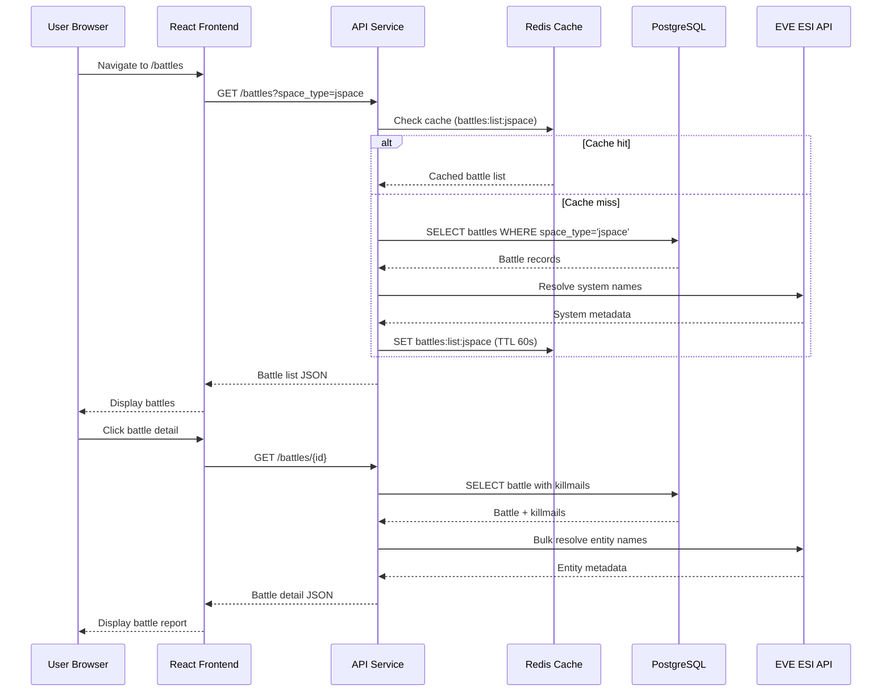

# BattleScope System Architecture

**Version**: 3.0
**Last Updated**: 2025-11-12
**Status**: Production

---

## Table of Contents

1. [System Overview](#system-overview)
2. [High-Level Architecture](#high-level-architecture)
3. [Component Architecture](#component-architecture)
4. [Data Flow](#data-flow)
5. [Technology Stack](#technology-stack)
6. [Deployment Architecture](#deployment-architecture)
7. [Security Architecture](#security-architecture)
8. [Observability Architecture](#observability-architecture)

---

## System Overview

### Purpose

BattleScope is a modular data intelligence platform for EVE Online that provides real-time battle reconstruction and combat intelligence through automated killmail ingestion, clustering, and analysis.

### Core Features

**Battle Reports** (`@battlescope/battle-reports`)
- Automated killmail ingestion from zKillboard
- Intelligent clustering of related killmails into battles
- Real-time battle reconstruction and visualization
- Configurable ingestion filters (alliances, systems, security types)

**Battle Intel** (`@battlescope/battle-intel`)
- Statistical analysis of combat activities
- Opponent tracking and relationship analysis
- Ship composition and doctrine detection
- Geographic activity heatmaps

### Design Principles

1. **Feature-Based Architecture**: Business logic separated at package level
2. **Reference-First Storage**: Minimal data footprint by storing only essential metadata
3. **Microservices Pattern**: Independent, scalable services with clear responsibilities
4. **Event-Driven Processing**: Asynchronous job queues for data enrichment
5. **Cloud-Native**: Kubernetes-first deployment with horizontal scaling
6. **Observable**: Comprehensive logging, metrics, and tracing

---

## High-Level Architecture

```mermaid
graph TB
    subgraph "External Services"
        ZKB[zKillboard RedisQ]
        ZKB_API[zKillboard API]
        ESI[EVE Swagger Interface]
    end

    subgraph "Frontend Layer"
        WEB[React SPA Frontend]
    end

    subgraph "API Gateway"
        API[API Service<br/>Fastify REST API]
    end

    subgraph "Ingestion Pipeline"
        INGEST[Ingest Service<br/>zKillboard RedisQ Poller]
        ENRICH[Enrichment Service<br/>BullMQ Worker]
    end

    subgraph "Processing Layer"
        CLUSTER[Clusterer Service<br/>Battle Reconstruction]
        SCHEDULER[Scheduler Service<br/>Periodic Jobs CronJob]
        SEARCH_SYNC[Search Sync Service<br/>Typesense Indexer]
        VERIFIER[Verifier Service<br/>Data Validation]
    end

    subgraph "Data Layer"
        POSTGRES[(PostgreSQL 15<br/>Primary Database)]
        REDIS[(Redis 7<br/>Cache & Queue)]
        TYPESENSE[(Typesense<br/>Search Engine)]
    end

    subgraph "Observability Stack"
        PROMETHEUS[Prometheus<br/>Metrics]
        LOKI[Loki<br/>Logs]
        JAEGER[Jaeger<br/>Traces]
        GRAFANA[Grafana<br/>Dashboards]
        PROMTAIL[Promtail<br/>Log Collector]
        OTEL[OTEL Collector<br/>Telemetry Pipeline]
    end

    subgraph "Shared Packages"
        DATABASE[@battlescope/database<br/>Kysely Client]
        ESI_CLIENT[@battlescope/esi-client<br/>EVE API Client]
        AUTH[@battlescope/auth<br/>Authentication]
        SEARCH[@battlescope/search<br/>Typesense Client]
        SHARED[@battlescope/shared<br/>Common Types & Utils]
        BR_PKG[@battlescope/battle-reports<br/>Clustering Engine]
        BI_PKG[@battlescope/battle-intel<br/>Analytics Engine]
    end

    %% External connections
    ZKB -->|RedisQ Pull| INGEST
    ZKB_API -->|Killmail Details| ENRICH
    ESI -->|Character/Corp/Alliance Data| API
    ESI -->|Entity Lookups| SEARCH_SYNC

    %% Frontend to API
    WEB -->|HTTP/SSE| API

    %% API to data layer
    API -->|Query| POSTGRES
    API -->|Cache| REDIS
    API -->|Search| TYPESENSE

    %% Ingestion flow
    INGEST -->|Write Killmail Refs| POSTGRES
    INGEST -->|Queue Job| REDIS
    REDIS -->|Consume| ENRICH
    ENRICH -->|Enrich Killmail| POSTGRES

    %% Processing flow
    CLUSTER -->|Read| POSTGRES
    CLUSTER -->|Write Battles| POSTGRES
    SCHEDULER -->|Trigger| CLUSTER
    SEARCH_SYNC -->|Index| TYPESENSE
    SEARCH_SYNC -->|Read| POSTGRES
    VERIFIER -->|Validate| POSTGRES

    %% Shared package usage
    API -.->|Uses| DATABASE
    API -.->|Uses| ESI_CLIENT
    API -.->|Uses| AUTH
    API -.->|Uses| SEARCH
    API -.->|Uses| SHARED
    INGEST -.->|Uses| DATABASE
    ENRICH -.->|Uses| DATABASE
    CLUSTER -.->|Uses| BR_PKG
    CLUSTER -.->|Uses| DATABASE

    %% Observability connections
    API -->|Metrics| OTEL
    INGEST -->|Metrics| OTEL
    ENRICH -->|Metrics| OTEL
    CLUSTER -->|Metrics| OTEL
    API -->|Logs| PROMTAIL
    INGEST -->|Logs| PROMTAIL
    ENRICH -->|Logs| PROMTAIL
    CLUSTER -->|Logs| PROMTAIL
    OTEL -->|Export| PROMETHEUS
    OTEL -->|Export| JAEGER
    PROMTAIL -->|Forward| LOKI
    PROMETHEUS -->|Query| GRAFANA
    LOKI -->|Query| GRAFANA
    JAEGER -->|Query| GRAFANA

    classDef external fill:#e1f5ff,stroke:#0366d6
    classDef frontend fill:#d4edda,stroke:#28a745
    classDef service fill:#fff3cd,stroke:#ffc107
    classDef data fill:#f8d7da,stroke:#dc3545
    classDef obs fill:#e7e7ff,stroke:#6610f2
    classDef pkg fill:#f5f5f5,stroke:#6c757d

    class ZKB,ZKB_API,ESI external
    class WEB frontend
    class API,INGEST,ENRICH,CLUSTER,SCHEDULER,SEARCH_SYNC,VERIFIER service
    class POSTGRES,REDIS,TYPESENSE data
    class PROMETHEUS,LOKI,JAEGER,GRAFANA,PROMTAIL,OTEL obs
    class DATABASE,ESI_CLIENT,AUTH,SEARCH,SHARED,BR_PKG,BI_PKG pkg
```

---

## Component Architecture

### Services

#### API Service (`backend/api`)

**Purpose**: REST API gateway providing access to battle data, search, and admin functions.

**Responsibilities**:
- Expose REST endpoints for battles, killmails, search, admin, and authentication
- Handle authentication and authorization via EVE SSO
- Serve Swagger UI for API documentation
- Implement rate limiting and request validation
- SSE streaming for real-time killmail feed

**Technology**: Fastify, Zod validation, OpenTelemetry instrumentation

**Key Dependencies**:
- `@battlescope/database` - Data access
- `@battlescope/esi-client` - EVE API integration
- `@battlescope/auth` - Authentication
- `@battlescope/search` - Typesense search client

**Endpoints**:
- `GET /battles` - List battles with filtering
- `GET /battles/:id` - Battle details
- `GET /killmails/recent` - Recent killmails
- `GET /killmails/stream` - SSE killmail stream
- `POST /search/battles` - Search battles
- `GET /admin/*` - Admin management endpoints
- `GET /auth/*` - Authentication flow

**Configuration**: See [services/api-service.md](services/api-service.md)

---

#### Ingest Service (`backend/ingest`)

**Purpose**: Pull killmails from zKillboard RedisQ and apply ingestion filters.

**Responsibilities**:
- Poll zKillboard RedisQ feed at configurable interval
- Apply ruleset filters (min pilots, alliances, corps, systems, security types)
- Store minimal killmail metadata
- Queue accepted killmails for enrichment
- Publish ingestion events via Redis pub/sub
- Track ingestion statistics

**Technology**: Node.js, BullMQ, ioredis, Kysely

**Key Dependencies**:
- `@battlescope/database` - Killmail storage
- `@battlescope/shared` - Logging and telemetry

**Data Flow**:
1. Pull from zKillboard RedisQ (`https://zkillredisq.stream/listen.php`)
2. Apply ruleset filters (loaded from `rulesets` table)
3. Write to `killmails` table (if accepted)
4. Queue job in Redis for enrichment

**Configuration**: See [services/ingest-service.md](services/ingest-service.md)

---

#### Enrichment Service (`backend/enrichment`)

**Purpose**: Fetch full killmail payloads from zKillboard API and enrich database records.

**Responsibilities**:
- Consume enrichment jobs from BullMQ queue
- Fetch full killmail JSON from zKillboard API
- Extract participant details (characters, corps, alliances, ships)
- Store enriched data in database
- Update enrichment status tracking
- Respect zKillboard rate limits

**Technology**: BullMQ worker, HTTP client, Kysely

**Key Dependencies**:
- `@battlescope/database` - Data access
- `@battlescope/shared` - Logging and telemetry

**Processing Flow**:
1. Consume job from `enrichment:queue` (Redis)
2. Fetch from `https://zkillboard.com/api/killID/{killmailId}/`
3. Parse victim and attacker data
4. Write to `battle_killmails` and `battle_participants`
5. Mark enrichment as succeeded/failed

**Configuration**: See [services/enrichment-service.md](services/enrichment-service.md)

---

#### Clusterer Service (`backend/clusterer`)

**Purpose**: Group related killmails into battles using temporal and spatial clustering.

**Responsibilities**:
- Process unprocessed enriched killmails
- Apply sliding window clustering algorithm
- Detect participant overlap and temporal proximity
- Create battle records with metadata
- Compute battle statistics (ISK destroyed, participants, duration)
- Generate zKillboard "related kills" URLs

**Technology**: Node.js, Kysely, `@battlescope/battle-reports` package

**Key Dependencies**:
- `@battlescope/battle-reports` - Clustering engine
- `@battlescope/database` - Data access

**Clustering Algorithm**:
- **Time Window**: 30 minutes (configurable)
- **Max Gap**: 15 minutes between consecutive kills
- **Min Kills**: 2 kills minimum per battle
- **Correlation**: Shared attackers/victims across killmails

**Data Model**:
- Input: `battle_killmails` (enriched)
- Output: `battles`, `battle_participants`

**Configuration**: See [services/clusterer-service.md](services/clusterer-service.md)

---

#### Scheduler Service (`backend/scheduler`)

**Purpose**: Execute periodic maintenance and batch jobs.

**Responsibilities**:
- Trigger clustering runs at intervals
- Perform database maintenance (vacuum, analyze)
- Clear stale cache entries
- Generate periodic statistics
- Execute data retention policies

**Technology**: Node.js CronJob (Kubernetes CronJob)

**Key Dependencies**:
- `@battlescope/database` - Data access

**Scheduled Jobs**:
- Clustering: Every 5 minutes
- Cache cleanup: Every hour
- Statistics refresh: Every 30 minutes
- Database maintenance: Daily at 2 AM UTC

**Configuration**: See [services/scheduler-service.md](services/scheduler-service.md)

---

#### Search Sync Service (`backend/search-sync`)

**Purpose**: Synchronize database records to Typesense search engine.

**Responsibilities**:
- Index battles and entities in Typesense
- Handle incremental updates
- Manage search schema and collections
- Resolve entity names via ESI
- Keep search index consistent with database

**Technology**: Node.js, Typesense client, Kysely

**Key Dependencies**:
- `@battlescope/search` - Typesense client
- `@battlescope/database` - Data access
- `@battlescope/esi-client` - Entity name resolution

**Sync Strategy**:
- Full reindex: On startup or schema change
- Incremental: Process database change events
- Batch size: 1000 documents per batch

**Configuration**: See [services/search-sync-service.md](services/search-sync-service.md)

---

#### Verifier Service (`backend/verifier`)

**Purpose**: Validate data integrity and detect anomalies.

**Responsibilities**:
- Verify killmail data completeness
- Detect orphaned records
- Validate battle clustering accuracy
- Check for duplicate records
- Monitor data quality metrics

**Technology**: Node.js, Kysely

**Key Dependencies**:
- `@battlescope/database` - Data access

**Validation Checks**:
- Orphaned killmails (not in any battle)
- Battles with missing participants
- Invalid timestamps
- Duplicate killmail IDs
- Missing entity names

**Configuration**: See [services/verifier-service.md](services/verifier-service.md)

---

#### Frontend Application (`frontend`)

**Purpose**: User-facing web application for viewing battles and analytics.

**Responsibilities**:
- Display battle list and detail views
- Real-time killmail feed via SSE
- Search functionality
- Admin interface for configuration
- User profile and character management
- Authentication flow

**Technology**: React 18, Vite, TanStack Query, TailwindCSS

**Key Routes**:
- `/` - Home dashboard
- `/battles` - Battle list
- `/battles/:id` - Battle details
- `/killmails` - Recent killmails feed
- `/search` - Search interface
- `/admin` - Admin panel
- `/profile` - User profile

**Configuration**: See [services/frontend.md](services/frontend.md)

---

### Shared Packages

#### Database (`packages/database`)

**Purpose**: Centralized database client and schema definitions.

**Exports**:
- Kysely client factory
- Type-safe database schema
- Migration utilities
- Connection pooling
- Query helpers

**Database**: PostgreSQL 15
**Query Builder**: Kysely 0.27
**Migrations**: Custom migration runner

---

#### ESI Client (`packages/esi-client`)

**Purpose**: EVE Swagger Interface API client with caching.

**Features**:
- Type-safe ESI endpoints
- Redis caching with TTL
- Rate limiting
- Automatic retries
- Error handling
- OpenTelemetry tracing

**Cache Strategy**:
- Public endpoints: 5 min TTL
- Character data: 1 hour TTL
- Static data: 24 hour TTL

---

#### Auth (`packages/auth`)

**Purpose**: Authentication and authorization system.

**Features**:
- EVE Online SSO OAuth2 flow
- Multi-character support
- Session management (Redis)
- JWT token generation
- Feature-scoped RBAC
- Encrypted token storage

**Status**: Partially implemented (see [authenication-authorization-spec](authenication-authorization-spec/README.md))

---

#### Search (`packages/search`)

**Purpose**: Typesense search client and schema management.

**Features**:
- Type-safe search queries
- Collection schema definitions
- Faceted search
- Fuzzy matching
- Entity name indexing

---

#### Shared (`packages/shared`)

**Purpose**: Common utilities and types shared across all services.

**Exports**:
- Logger configuration (Pino)
- OpenTelemetry setup
- Common types and schemas
- Environment variable validation
- Error classes
- Utility functions

---

#### Battle Reports (`packages/battle-reports`)

**Purpose**: Clustering engine and battle reconstruction logic.

**Exports**:
- Clustering algorithm
- Battle builder
- Data repositories
- Business logic services

---

#### Battle Intel (`packages/battle-intel`)

**Purpose**: Analytics and intelligence computation.

**Exports**:
- Statistics aggregators
- Opponent analysis
- Ship composition analysis
- Geographic intelligence

---

## Data Flow

### Killmail Ingestion Flow


### Battle Retrieval Flow



### Real-Time Killmail Stream


---

## Technology Stack

### Backend

| Component | Technology | Version | Purpose |
|-----------|-----------|---------|---------|
| **Runtime** | Node.js | 20 LTS | JavaScript runtime |
| **Language** | TypeScript | 5.4.5 | Type-safe development |
| **API Framework** | Fastify | 4.26.2 | High-performance HTTP server |
| **Validation** | Zod | 3.22.4 | Schema validation |
| **Database** | PostgreSQL | 15 | Primary data store |
| **Query Builder** | Kysely | 0.27.2 | Type-safe SQL queries |
| **Cache/Queue** | Redis | 7 | Caching and job queues |
| **Job Queue** | BullMQ | 4.13.1 | Background job processing |
| **Search** | Typesense | 0.25 | Full-text search |
| **Logging** | Pino | 8.17.0 | Structured logging |
| **Tracing** | OpenTelemetry | 1.9.0 | Distributed tracing |

### Frontend

| Component | Technology | Version | Purpose |
|-----------|-----------|---------|---------|
| **Framework** | React | 18 | UI library |
| **Build Tool** | Vite | 5 | Fast build tooling |
| **Data Fetching** | TanStack Query | 5 | Server state management |
| **Styling** | TailwindCSS | 3 | Utility-first CSS |
| **Routing** | React Router | 6 | Client-side routing |

### Infrastructure

| Component | Technology | Version | Purpose |
|-----------|-----------|---------|---------|
| **Orchestration** | Kubernetes | 1.27+ | Container orchestration |
| **Containerization** | Docker | 24+ | Application containers |
| **Ingress** | NGINX Ingress | Latest | HTTP routing |
| **TLS** | cert-manager | Latest | Automated TLS certs |

### Observability

| Component | Technology | Version | Purpose |
|-----------|-----------|---------|---------|
| **Metrics** | Prometheus | 2.45+ | Metrics collection |
| **Logs** | Loki | 2.9+ | Log aggregation |
| **Traces** | Jaeger | 1.50+ | Trace visualization |
| **Dashboards** | Grafana | 10+ | Unified dashboards |
| **Log Collection** | Promtail | 2.9+ | Log shipper |
| **Telemetry Pipeline** | OTEL Collector | 0.88+ | Telemetry routing |

---

## Deployment Architecture

### Kubernetes Cluster Layout

```
Namespace: battlescope
├── Deployments (Stateless)
│   ├── api (replicas: 2)
│   ├── ingest (replicas: 1)
│   ├── enrichment (replicas: 1)
│   ├── clusterer (replicas: 1)
│   ├── search-sync (replicas: 1)
│   ├── verifier (replicas: 1)
│   ├── frontend (replicas: 2)
│   ├── prometheus (replicas: 1)
│   ├── grafana (replicas: 1)
│   └── jaeger (replicas: 1)
├── StatefulSets (Stateful)
│   ├── postgres (replicas: 1)
│   ├── redis (replicas: 1)
│   └── typesense (replicas: 1)
├── DaemonSets
│   └── promtail (all nodes)
├── CronJobs
│   └── scheduler (schedule: */5 * * * *)
└── Services
    ├── api (ClusterIP + Ingress)
    ├── postgres (ClusterIP)
    ├── redis (ClusterIP)
    ├── typesense (ClusterIP)
    ├── prometheus (ClusterIP)
    ├── grafana (ClusterIP + Ingress)
    └── jaeger (ClusterIP)
```

### Resource Allocation

| Service | CPU Request | CPU Limit | Memory Request | Memory Limit |
|---------|-------------|-----------|----------------|--------------|
| **API** | 200m | 1000m | 256Mi | 1Gi |
| **Ingest** | 100m | 500m | 128Mi | 512Mi |
| **Enrichment** | 100m | 500m | 256Mi | 1Gi |
| **Clusterer** | 200m | 1000m | 512Mi | 2Gi |
| **Scheduler** | 50m | 200m | 64Mi | 256Mi |
| **Search Sync** | 100m | 500m | 256Mi | 1Gi |
| **Verifier** | 50m | 200m | 128Mi | 512Mi |
| **Frontend** | 50m | 200m | 64Mi | 256Mi |
| **PostgreSQL** | 500m | 2000m | 1Gi | 4Gi |
| **Redis** | 100m | 500m | 256Mi | 1Gi |
| **Typesense** | 200m | 1000m | 512Mi | 2Gi |
| **Prometheus** | 200m | 1000m | 512Mi | 2Gi |
| **Grafana** | 100m | 500m | 256Mi | 1Gi |
| **Jaeger** | 100m | 500m | 256Mi | 1Gi |
| **Promtail** | 50m | 200m | 64Mi | 256Mi |

### Horizontal Pod Autoscaling

**API Service**:
- Min replicas: 2
- Max replicas: 10
- Target CPU: 60%
- Target Memory: 70%

**Frontend**:
- Min replicas: 2
- Max replicas: 5
- Target CPU: 50%

---

## Security Architecture

### Authentication

- **EVE Online SSO**: OAuth2/OIDC authentication
- **Session Management**: HTTP-only secure cookies, Redis-backed sessions
- **Token Storage**: Encrypted ESI tokens in PostgreSQL
- **Multi-Factor**: EVE SSO provides 2FA

### Authorization

- **Feature-Scoped RBAC**: Roles per feature (user, fc, director, admin)
- **Policy Enforcement**: Fastify middleware checks
- **Cache**: Authorization decisions cached in Redis (60s TTL)

### Network Security

- **TLS**: All external traffic encrypted (cert-manager + Let's Encrypt)
- **Network Policies**: Kubernetes NetworkPolicies restrict pod-to-pod traffic
- **Secrets**: Kubernetes Secrets for credentials, encrypted at rest

### Application Security

- **Input Validation**: Zod schemas on all endpoints
- **SQL Injection**: Kysely parameterized queries
- **Rate Limiting**: Fastify rate-limit plugin
- **CORS**: Configured via `@fastify/cors`
- **Helmet**: Security headers via Fastify plugins

---

## Observability Architecture

### Logging Strategy

**Format**: Pino structured JSON logs
**Collection**: Promtail DaemonSet → Loki
**Retention**: 1 hour (configurable)
**Query**: LogQL via Grafana

**Log Context** (all logs include):
- `file`: Source file path (e.g., `backend/api/src/routes/battles.ts`)
- `package`: Package name (e.g., `api`, `ingest`)
- `caller`: Function name
- `level`: Log level (info, warn, error)
- `timestamp`: ISO 8601 timestamp

**Example**:
```json
{
  "level": 30,
  "time": 1699876543210,
  "pid": 1234,
  "hostname": "api-7d8f9-abcd",
  "file": "backend/api/src/routes/battles.ts",
  "package": "api",
  "caller": "listBattles",
  "msg": "Fetching battles",
  "space_type": "jspace",
  "limit": 20
}
```

### Metrics Strategy

**Collector**: OpenTelemetry SDK → OTEL Collector → Prometheus
**Scrape Interval**: 15s
**Retention**: 15 days
**Query**: PromQL via Grafana

**Key Metrics**:
- `http_requests_total` - HTTP request count by route, status
- `http_request_duration_seconds` - Request latency histogram
- `killmail_ingestion_total` - Killmails ingested count
- `battle_clustering_duration_seconds` - Clustering job duration
- `database_query_duration_seconds` - Database query latency
- `redis_operations_total` - Redis operation count
- `typesense_search_duration_seconds` - Search query latency

### Tracing Strategy

**Protocol**: OpenTelemetry → OTEL Collector → Jaeger
**Sampling**: 100% (adjust in production)
**Retention**: 7 days
**Query**: Jaeger UI via Grafana

**Traced Operations**:
- HTTP requests (Fastify auto-instrumentation)
- Database queries (Kysely custom instrumentation)
- Redis operations (ioredis auto-instrumentation)
- External API calls (ESI, zKillboard)
- Job processing (BullMQ custom instrumentation)

### Dashboards

**Grafana Dashboards**:
1. **System Overview**: Service health, request rates, error rates
2. **API Performance**: Endpoint latency, throughput, error breakdown
3. **Ingestion Pipeline**: Killmail rates, enrichment queue depth, success rates
4. **Clustering**: Battles created, clustering duration, backlog
5. **Database**: Connection pool, query performance, cache hit rates
6. **Redis**: Memory usage, operation rates, queue depths
7. **Typesense**: Search latency, index size, query volume

---

## Architectural Decisions

### ADR-001: Monorepo with PNPM Workspaces

**Decision**: Use PNPM workspace monorepo for all services and packages.

**Rationale**:
- Shared type definitions across services
- Simplified dependency management
- Atomic cross-package changes
- Faster CI builds with caching

**Alternatives Considered**: Polyrepo, Lerna, Yarn workspaces

---

### ADR-002: Kysely for Database Access

**Decision**: Use Kysely query builder instead of ORM.

**Rationale**:
- Type-safe SQL without magic
- Predictable query generation
- No runtime overhead
- Full control over queries
- Migration-friendly

**Alternatives Considered**: Prisma, TypeORM, raw SQL

---

### ADR-003: BullMQ for Job Queues

**Decision**: Use BullMQ for enrichment job processing.

**Rationale**:
- Built on Redis (already in stack)
- Type-safe job definitions
- Built-in retries and rate limiting
- Job prioritization
- UI for monitoring

**Alternatives Considered**: Agenda, pg-boss, AWS SQS

---

### ADR-004: Typesense for Search

**Decision**: Use Typesense for full-text search.

**Rationale**:
- Typo tolerance and fuzzy matching
- Fast indexing and search
- Simpler than Elasticsearch
- Built-in faceting
- Lower resource footprint

**Alternatives Considered**: Elasticsearch, MeiliSearch, PostgreSQL full-text

---

### ADR-005: Feature-Based Package Structure

**Decision**: Separate Battle Reports and Battle Intel into distinct packages.

**Rationale**:
- Independent scaling and deployment
- Feature-specific permissions
- Clear ownership boundaries
- Reduced coupling
- Easier to add new features

---

## References

- [Product Specifications](product_specs.md)
- [Technical Specifications](technical_specs.md)
- [Battle Reports Feature Spec](features/battle-reports/feature-spec.md)
- [Battle Intel Feature Spec](features/battle-intel/feature-spec.md)
- [Authentication Specification](authenication-authorization-spec/README.md)
- [Observability Documentation](observability/database-metrics-exporters.md)
